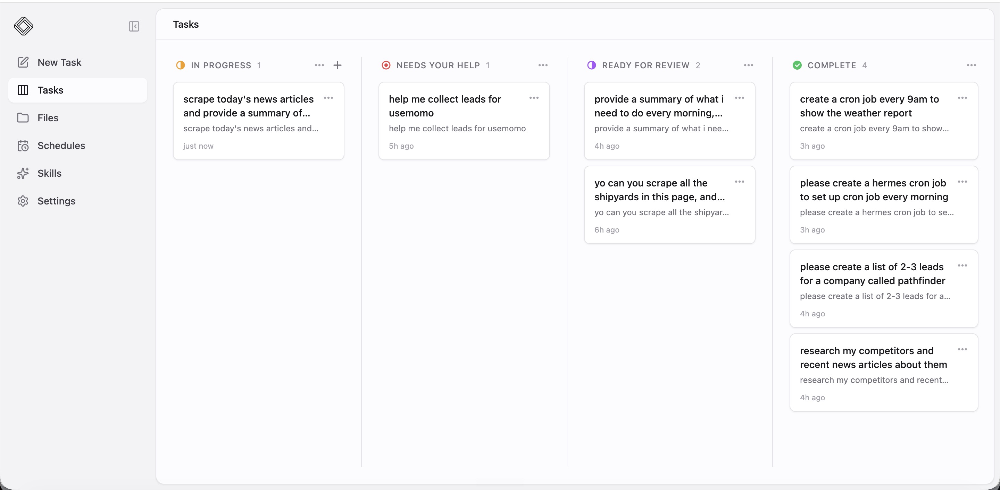

# Minions

**Mission Control for Hermes Agent**

Hermes Agent is powerful, but running real work on it means juggling terminal sessions, losing track of which job finished, and manually checking on long-running tasks. The more you delegate, the harder it gets to manage.

Minions gives you one screen for all of it.

Create tasks through chat, and your Hermes agent works on them autonomously, running tools, spawning sessions, scheduling cron jobs. Automatic heartbeat check-ins tell you what's progressing, what's blocked, and what's ready for review. You supervise the board. The agent does the work.

## Demo

[](demo/loom-minions.mp4)

[Watch the 64-second demo](demo/loom-minions.mp4)

## Why Minions Exists

The first agent task is fun. The tenth is operations.

Power users do not just ask an agent one question. They delegate research, coding, monitoring, sales ops, writing, and recurring workflows. Those jobs take time. They get blocked. They need review. Cron runs disappear into the background. Context fills up.

Minions turns Hermes sessions into durable, reviewable work.

## Not Just A Board

Minions is not just a task board. Every in-progress task gets periodic heartbeat check-ins.

During a heartbeat, the Hermes session is asked to make progress, retry with a different approach if stuck, and only ask for help after it has genuinely exhausted alternatives. If it needs you, the task moves to **Needs your help**. If it finishes, it moves to **Ready for review**.

## Features

- **Kanban board**: see every task at a glance: in progress, blocked, in review, done
- **Autonomous execution**: describe what you want in chat, walk away; the agent decides how to get it done
- **Heartbeat check-ins**: agents self-report progress on a schedule; blocked work surfaces automatically
- **Live streaming**: watch tool calls, reasoning, and responses in real time
- **Human-in-the-loop**: agents propose completion; you verify and close. Nothing moves to done without your sign-off
- **Per-task model control**: override model and reasoning effort on any task
- **Cron visibility**: see every scheduled Hermes job, its history, and output
- **Local-first**: SQLite, no account, no hosted service. Your data stays on your machine

## Quick Start

**Prerequisites:** Node.js 18+ and [Hermes Agent](https://hermes-agent.nousresearch.com) installed

```bash
git clone https://github.com/Agent-3-7/hermes-agent-mission-control.git
cd hermes-agent-mission-control
npm install
npm run dev
```

Open [http://localhost:6969](http://localhost:6969), create a task, and send your first message.

Production build:

```bash
npm run prod
```

No `.env` file needed. Defaults work out of the box.

## How It Works

```
Browser (React + Vite)
  ↕ HTTP + SSE
Express server (:6969)
  ↕ JSONL stdin/stdout
Python worker → Hermes AIAgent
```

Each task is a persistent Hermes root session. You talk to it, it works, it checks in, and the board reflects where everything stands. Chat transcripts live in Hermes's session database; Minions stores task metadata, status, heartbeat history, and per-task settings in a local SQLite database.

## Who It's For

- **Hermes power users** juggling multiple sessions across projects
- **Indie founders** delegating research, ops, writing, and coding to their agent
- **Anyone running long-lived Hermes work** who needs to know what finished, what's stuck, and what needs attention

## Hosted Version

Don't want to self-host? [Agent37](https://www.agent37.com) offers Minions as a hosted service with team features.

## Roadmap

- **File support**: attach files to tasks, browse artifacts agents create
- **Notifications**: get alerted via Telegram, WhatsApp, or webhook when a task is blocked or needs review
- **Skills library**: pluggable skill templates for common workflows (lead gen, web research, content pipelines, data collection, competitive monitoring, outbound sequences)
- **Cron management**: edit schedules and parameters, delete jobs, failure alerts
- **Workspace file browser**: see files agents have created per task without SSH-ing in
- **OpenClaw adapter**: run Minions against OpenClaw-hosted agents

## FAQ

**Is this an official Hermes Agent project?**
No. Minions is an independent open-source project built for Hermes Agent.

**Can I use this with other agents?**
Not yet. The adapter interface exists, but launch is Hermes-only. OpenClaw is next.

## Contributing

Contributions welcome. See [CLAUDE.md](CLAUDE.md) for architecture and development details.

## License

MIT
